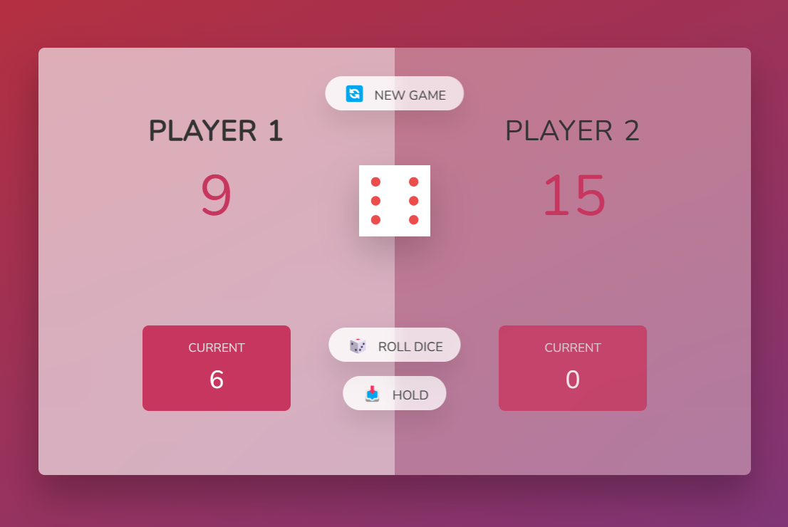

## Table of contents

- [Overview](#overview)
  - [Link](#links)
  - [Rules](#the-challenge)
  - [Screenshot](#screenshot)
- [Let's talk](#author)

### Overview
- Quick and simple dice game made with Vanilla JavaScript.

### Link
- [Live Link](https://dancodecraft-dice-game.vercel.app/)

### Rules
- Roll the dice to score points
- Hold your points to pass your turn.
- The first player who scores 100 points wins the game.
- If the player rolls a 1, the current score will be erased and the turn will be passed.
- Click New if you want to start again.

Good luck! 😊

### Screenshot

### Built with
- HTML
- CSS
- Vanilla JavaScript

## Let's talk
- Website - [LinkedIn](https://www.linkedin.com/in/adannjacinto/)
- Twitter - [@yourusername](https://www.twitter.com/DanCodeCraft)
